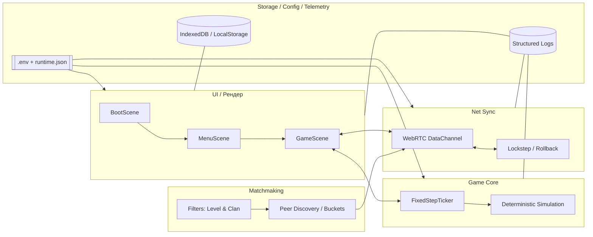
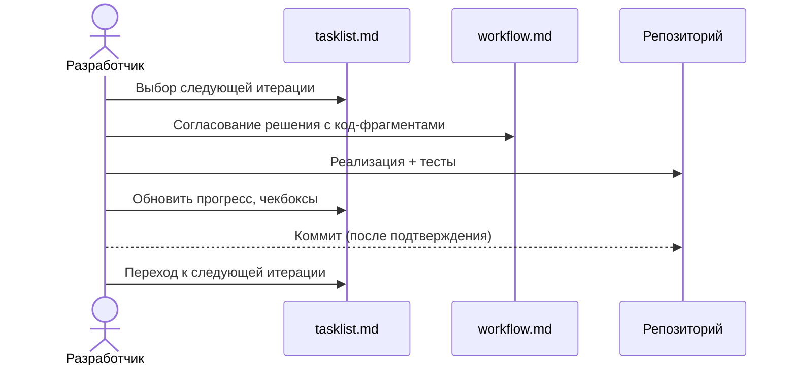

## Техническое введение в проект «Ниндзя‑файтинг» (онлайн, P2P, 1v1)

Краткое руководство для нового разработчика: из чего состоит проект, как он устроен и как по нему работать.

### Базовые ссылки
- Идея: [../idea.md](../idea.md)
- Техническое видение: [../vision.md](../vision.md)
- Правила разработки (конвенции): [../conventions.md](../conventions.md)
- План работ (итерации): [./tasklist.md](./tasklist.md)
- Workflow выполнения задач: [./workflow.md](./workflow.md)

### Обзор архитектуры (высокоуровнево)


### Целевая структура проекта (MVP)
```text
src/
  game/           # ядро симуляции: детерминированные апдейты, коллизии
  ui/             # сцены Phaser, HUD, ввод
    scenes/
  net/            # WebRTC транспорт, протокол, синхронизация кадров
  matchmaking/    # discovery по корзинам уровня, фильтр по клану
  storage/        # профиль игрока, W/L, клан
  config/         # типизированная конфигурация, валидация
  telemetry/      # логирование/метрики
public/
  index.html      # точка входа SPA
doc/
  tasklist.md     # итерационный план и прогресс
  workflow.md     # правила выполнения задач
  intro.md        # этот документ
```

### Минимальные примеры кода (ориентиры)
- Фиксированный тикер симуляции (детерминизм):
```ts
export class FixedStepTicker {
  private accumulatedMs = 0;
  constructor(
    private readonly stepDurationMs: number,
    private readonly onTick: () => void
  ) {}
  advanceByMs(elapsedMs: number): void {
    this.accumulatedMs += elapsedMs;
    while (this.accumulatedMs >= this.stepDurationMs) {
      this.onTick();
      this.accumulatedMs -= this.stepDurationMs;
    }
  }
}
```

- Вызов тикера из сцены (рендер отделён от логики):
```ts
import Phaser from 'phaser';
import { FixedStepTicker } from '@game/ticker';

export class GameScene extends Phaser.Scene {
  private tickCount = 0;
  private ticker!: FixedStepTicker;
  private label!: Phaser.GameObjects.Text;

  create() {
    this.label = this.add.text(12, 8, 'ticks: 0', { color: '#66ffcc' });
    this.ticker = new FixedStepTicker(16.6667, () => {
      this.tickCount += 1;
      this.label.setText(`ticks: ${this.tickCount}`);
    });
  }
  update(_t: number, dt: number) {
    this.ticker.advanceByMs(dt);
  }
}
```

- Модель данных (см. детали в [vision.md](../vision.md)):
```ts
type Clan = 'A' | 'B';

export type PlayerProfile = {
  playerId: string;
  publicKey: string; // Ed25519
  clan: Clan;        // назначается при регистрации
  wins: number;
  losses: number;
};
```

- Пример JSON‑лога (структурированное логирование):
```json
{
  "level": "info",
  "msg": "frame_applied",
  "matchId": "m-abc123",
  "peerId": "p-xyz",
  "frame": 240,
  "rttMs": 62
}
```

- Пример runtime‑конфига:
```json
{
  "stun": ["stun:stun.l.google.com:19302"],
  "bootstrap": ["wss://bootstrap.example.org"],
  "net": { "targetFps": 60, "inputDelayFrames": 2 },
  "features": { "rollback": true, "verboseLogs": false }
}
```

### Как работать по проекту
- Прочитать: [vision.md](../vision.md) и [conventions.md](../conventions.md).
- Действовать строго по плану: [tasklist.md](./tasklist.md).
- Следовать KISS‑workflow: [workflow.md](./workflow.md).



### Тестируемость по итерациям
См. колонку «🧪 Тестируемость» в [tasklist.md](./tasklist.md): каждая итерация содержит чёткий сценарий проверки.

### Замечания по P2P
- Соединение — P2P (WebRTC DataChannel). Допустимы STUN/легкий bootstrap‑сигналинг.
- Никакого центрального игрового сервера: логика и симуляция — на клиентах.
- Детерминизм ядра и синхронизация входов/состояний — критичны.

### Полезные команды (будут добавлены в реализациях)
- `npm run dev` — локальный запуск
- `npm test` — юнит/интеграционные тесты
- `npm run build` — сборка

Если обнаружите расхождение с архитектурой — сначала свериться с [vision.md](../vision.md), затем предложить правку плана в [tasklist.md](./tasklist.md).